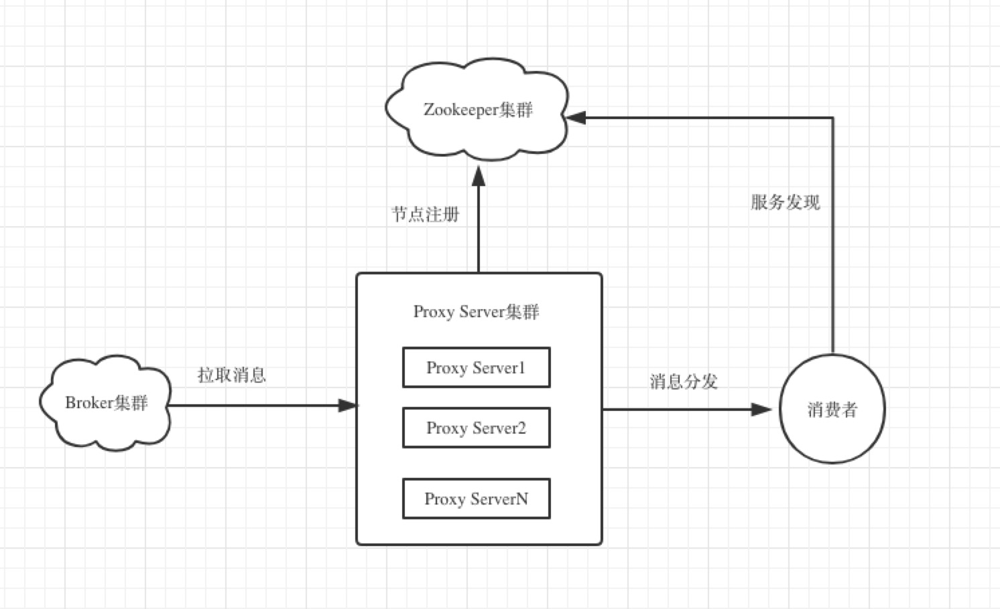
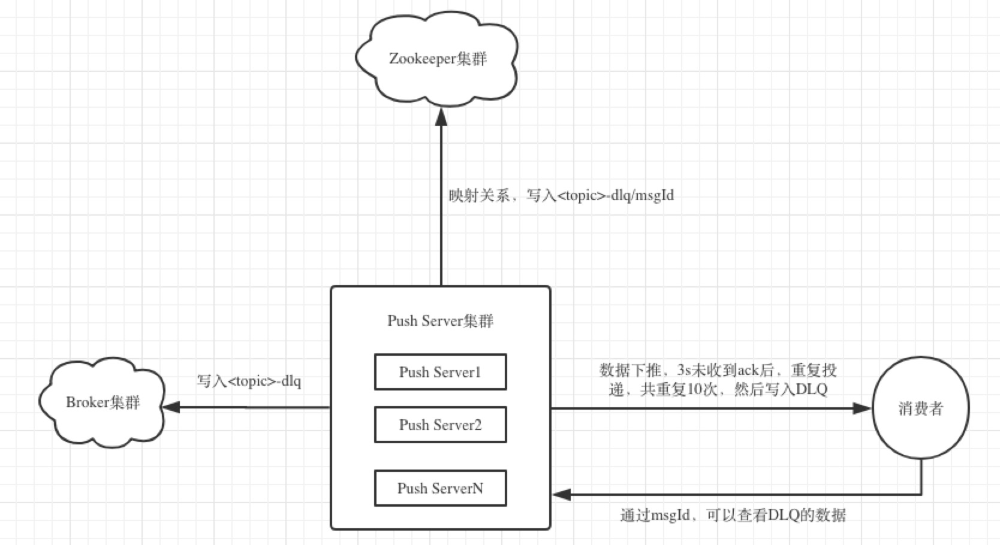

## 一. 背景
- Kafka的consumer数和parition数存在C:P的关系，如果C<=P,当某C节点挂掉，发生rebalance后，势必造成存活的某台C节点消费压力增大或导致消息消费时延增大。因此，实际的线上，C可能会部署大于P的情况以防止类似情形发生。多余的C即为standby。
另有情形下，少量的partiton数足以满足上游生产消息的速率，consumer的消费能力却成为瓶颈，因为consumer可能要处理更多的业务逻辑。如果想降低消息消费的延迟时间，只能扩大partion数量，进而增加consumer的数量，来增加消费能力，解决消息延迟性。
因此，一种代理模式就出现了，即kafka-proxy-server模式，即解决了所有线上C都可以消费到消息，又无需增大parition数来增大消费能力的情形。
- 引入proxy模式后，consumer和partiton形成解耦，且消息在proxy-server和client之间，可以加入重试队列，当消费失败后，可以在一定时间内重复收到消费失败的消息。
- 引入proxy模式后，消息无序，因此只有分区无序的场景下，才可以使用此代理。

## 二. 设计图



- Proxy Server： 即原生kafka的consumer，负责某些topic消息的拉取，分发。启动后，注册实例到zookeeper中。
- 消费者： 根据配置的topic，consumerGroup，namespace，通过zookeeper，获取对应的Push Server节点地址，建立连接，并接受Proxy server推送的消息。

## 三. 实现
- proxy-server proxy-server即原生kafka的consumer，启动后，每个实例至少消费一个parition，并设置手动提交offset。启动并监听指定端口接受consumer的tcp链接，并将端口等信息写入zookeeper。
  proxy-server每次拉取N多消息放入阻塞队列，当有consumer链接后，分发给consumer。所以，消息形成无序状态。
- pull模型 消息者启动后，通过配置信息，从zookeeper获取push-server节点信息，并和所有push-server建立tcp链接，然后发送pull消息请求，每次请求最多10条，最大16M的消息。并间隔60s发送心跳给push-server维持连接。
- push模型 消息启动后，通过配置信息，从zookeeper获取push-server节点信息，并和所有push-server建立tcp链接。然后，有push-server发送推送消息给consumer。
  push模型存在一定的问题，即consumer数量小于proxy-server时，推模型可能会压死consumer，所以不建议使用push模型。默认才用pull模型实现。

## 四. 快速使用

- 工程依赖: JDK1.7或更高版本
- Maven依赖:
```xml
<dependency>
    <groupId>com.owl.kafka</groupId>
    <artifactId>kafka-proxy-server</artifactId>
    <version>1.0.0-SNAPSHOT</version>
</dependency>
```

- proxy-server配置
src/main/resources下的proxy-server.properties为代理服务器的配置文件。
<table>
    <tr>
        <th>参数</th>
        <th>说明</th>
    </tr>
    <tr>
        <th>server.kafka.server.list</th>
        <th>kafka的集群地址</th>
    </tr>
    <tr>
        <th>server.kafka.server.list</th>
        <th>kafka的集群地址</th>
    </tr>
    <tr>
        <th>server.group.id</th>
        <th>proxy-server的消费组信息</th>
    </tr>
    <tr>
         <th>server.topic</th>
         <th>proxy-server消费的topic</th>
    </tr>
    <tr>
         <th>server.zookeeper.server.list</th>
         <th>proxy-server链接的zookeeper地址 </th>
    </tr>
    <tr>
         <th>server.queue.size</th>
         <th>proxy-server从kafka拉取多少消息到阻塞队列</th>
    </tr>
    <tr>
         <th>server.port</th>
         <th>proxy-server监听consumer的端口</th>
     </tr>
     <tr>
        <th>server.commit.offset.interval</th>
        <th>proxy-server提交offset的间隔时间</th>
     </tr>
    <tr>
        <th>server.commit.offset.batch.size</th>
        <th>proxy-server提交offset的批次大小</th>
     </tr>        
</table>

## 五. 关于DLQ

- 原生的kafka不支持消息的重复投递以及多次投递后进入DLQ的功能。proxy-server下推消息后，如果Ns(N=3默认)后未收到ack，将重复投递，共投递N次(N=5默认)。N次消费后未收到ack后，将失败的消息写入kafka的主题为<topic>-dlq中。
- 将失败消息的msgId和写入kafka的dlq中的offset的映射关系写入zk，后续可通过msgId查看DLQ消息。


