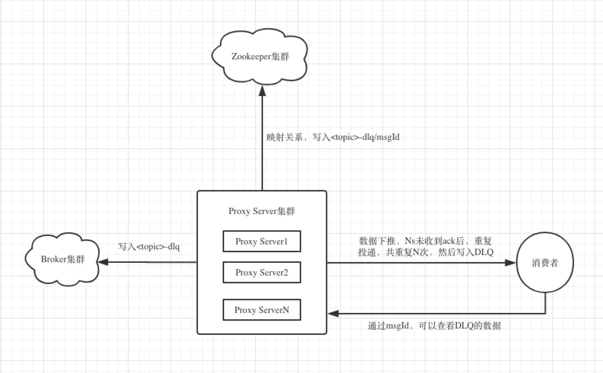

#### 一. 背景
- Kafka的consumer数大于partition数时，多出的consumer将无法消费到消息。如果想降低消息消费的延迟时间，只能扩大partion数量，
进而增加consumer的数量，来增加消费能力，解决消息延迟性。有些情形下，少量的partiton足以满足上游生产消息的速率，consumer的消费能力却成为瓶颈，
因为consumer可能要处理更多的业务逻辑。因此，一种代理模式就出现了，即kafka-push-server。
- 当引入代理模式后，consumer和partiton形成解耦，且消息在push-server和client之间，可以加入重试队列，当消费失败后，可以在一定时间内重复收到消费失败的消息。

#### 二. 设计图

- Push Server： 负责某些consumerGroup的消息拉取，分发。实现了consumer和partition的解耦。
- 消费者： 根据配置的topic，group，namespace通过zookeeper，获取对应的Push Server节点。

#### 三. 快速使用

- 工程依赖:
JDK1.7或更高版本 

- 配置push server

#### 四. 关于DLQ

- 1. push-server下推消息后，如果3s后未收到ack，将重复投递，共投递10次。10次后，将投递失败的消息写入kafka的主题为<topic>-dlq中。
- 2. 将失败消息的msgId和写入kafka的dlq中的offset的映射关系写入zk，后续可通过msgId查看DLQ消息。
